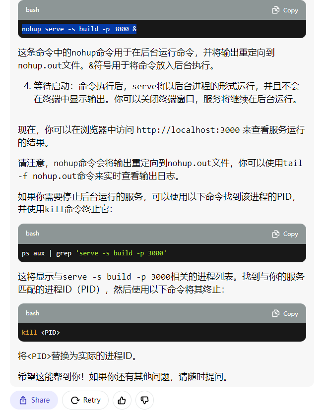

## Available Scripts

启动项目:

### `npm start`

打包:

### `npm run build`
nginx配置 /ect/nginx
发布更新：登录服务器，找到root -> front，替换 build 就行
启动包 
serve: serve -s build -p 3000
nohup serve -s build -p 3000 > nohup.out 2>&1 &
查状态 ps aux | grep 'serve -s build -p 3000'

